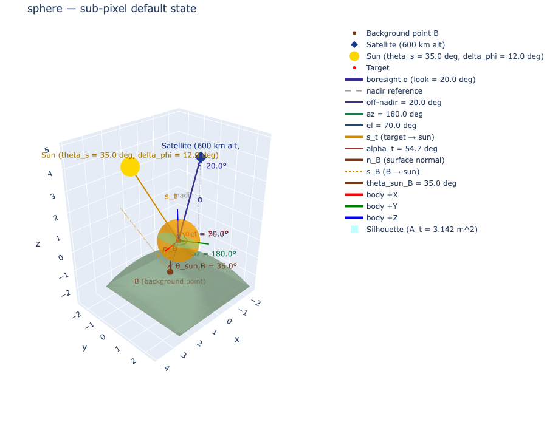
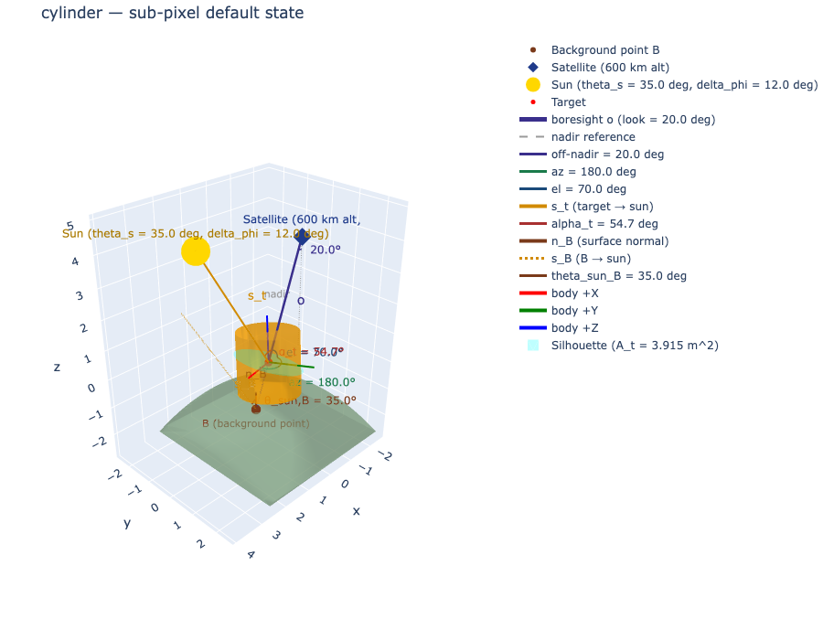
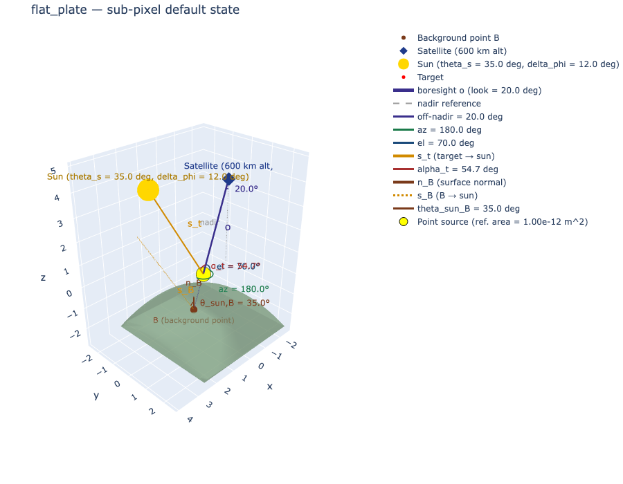
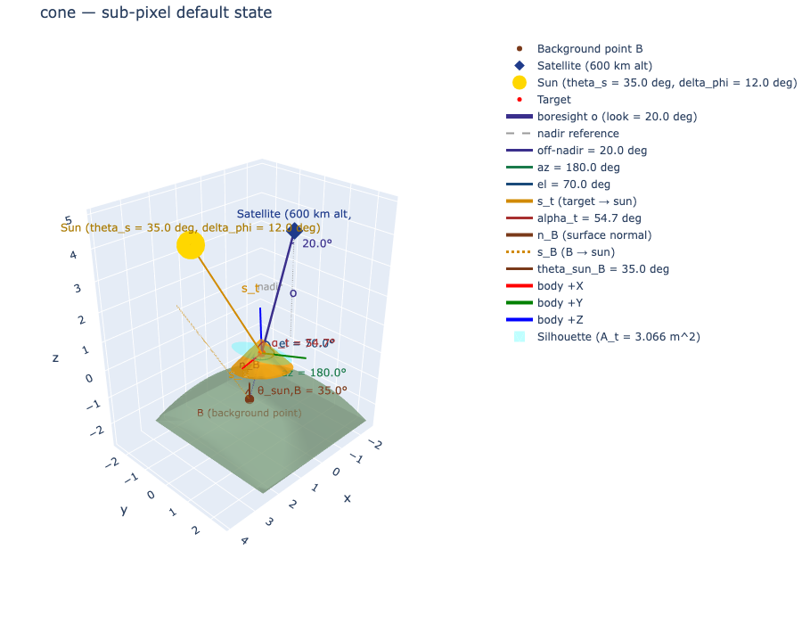
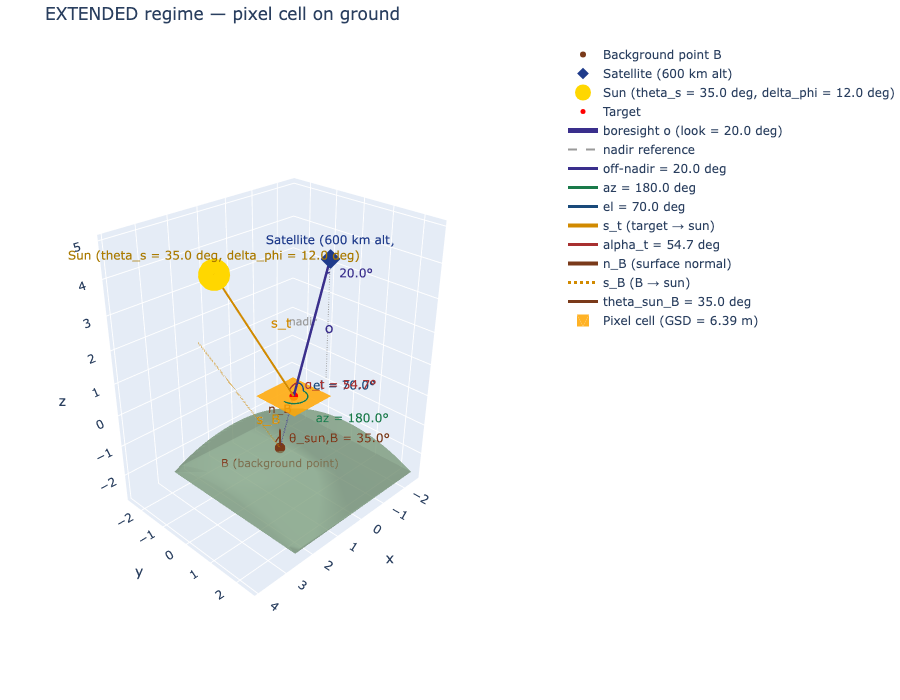
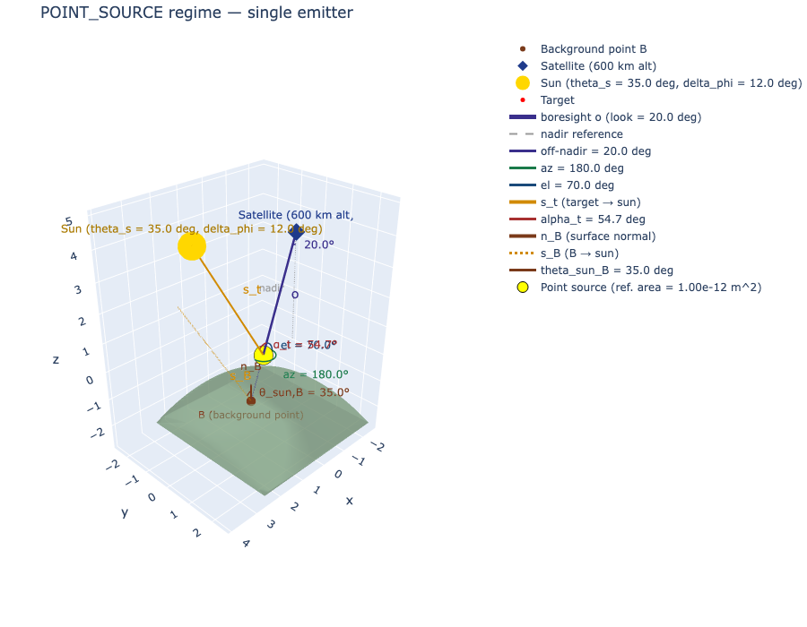
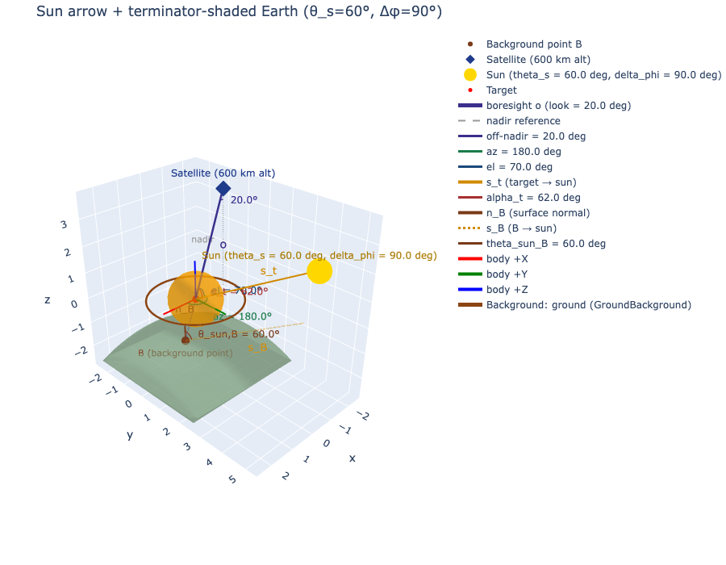

# Geometry GUI — Developer Tool

Interactive 3D scene visualizer for RADIANT geometry: observer, Earth, target (with orientation),
sun, and background. Built as an **independent developer tool**, not a production GUI.

## Hard rules
1. **Never edit anything under `/src/`.** This tool is a strict consumer of the public RADIANT API.
   If something needs a `/src` change to be visualizable, that gap is documented in [PLAN.md §Caveats](PLAN.md), not patched here.
2. **Code stays under `dev_tools/geometry_gui/app/`.** Tests under `dev_tools/geometry_gui/tests/`.
3. The on-screen projected-area number must come from the same call the radiometry would make
   (`TargetShape.projected_area(view_direction)`), not a parallel implementation.

## Run (under five minutes from a fresh clone)

```bash
# 1. Install dependencies (one-time):
pip install -r dev_tools/geometry_gui/requirements.txt

# 2. Launch the Dash server:
python -m dev_tools.geometry_gui.app.main

# 3. Open the GUI:
#    http://localhost:8050
```

Drag any slider on the left; the 3D scene and the readout panel on the right update on every
change. The shape dropdown swaps the target mesh; the regime radio forces or overrides
classification (`auto` / `extended` / `sub_pixel` / `point_source`). The readout panel reports
slant range, GSD, IFOV, projected area, and the current regime, with **units on every line**.

## Test

```bash
# Full GUI test suite (Phases 0–7):
pytest dev_tools/geometry_gui/tests/

# Or with verbose output:
pytest dev_tools/geometry_gui/tests/ -v
```

Notable headline tests:
- `test_projected_area_invariant.py` — C3 invariant: GUI A_t bit-exactly equals
  `shape.projected_area(view_dir)` across 50 random states + three Category-C truth anchors.
- `test_no_src_writes.py` — C1 gate: no commit in repo history bundles a `/src` change with a
  `dev_tools/geometry_gui/` change. Fails immediately if a future contributor breaks the
  separation.

## Screenshot gallery

Per-shape sub-pixel defaults:

| Shape | Screenshot |
|---|---|
| Sphere |  |
| Cylinder |  |
| Flat plate |  |
| Box |  |
| Cone |  |

Regime dispatch (Phase 4):

| Mode | Screenshot |
|---|---|
| EXTENDED — pixel cell |  |
| POINT_SOURCE — single emitter |  |

Sun arrow + Earth shading (Phase 6):



Regenerate the gallery after any visual change:
```bash
python -m dev_tools.geometry_gui.docs_screenshots.render_gallery
```

## Pre-commit hint (paste into `.git/hooks/pre-commit`)

The C1 invariant — no commit may bundle `/src/` changes with `dev_tools/geometry_gui/` changes —
can be enforced locally with:

```bash
#!/usr/bin/env bash
# Refuse commits that touch both /src and dev_tools/geometry_gui/.
staged=$(git diff --cached --name-only)
touches_src=$(echo "$staged" | grep -c '^src/' || true)
touches_gui=$(echo "$staged" | grep -c '^dev_tools/geometry_gui/' || true)
if [ "$touches_src" -gt 0 ] && [ "$touches_gui" -gt 0 ]; then
  echo "[reject] commit touches both /src and dev_tools/geometry_gui/."
  echo "         Split into two commits to preserve the C1 separation."
  exit 1
fi
```

Make it executable: `chmod +x .git/hooks/pre-commit`.

## CI hint (project owner can paste into `.github/workflows/`)

This tool does **not** modify the repo's CI config. If you want the GUI suite to run on every
PR, add a step similar to:

```yaml
- name: Geometry GUI tests
  run: pytest dev_tools/geometry_gui/tests/ -v
```

## Caveats (verbatim from [PLAN.md §8](PLAN.md))

| # | Gap | Workaround |
|---|---|---|
| G1 | `theta_s` / `delta_phi` are not in the legacy parameter schema yet (Stage-2 placeholder per `_inferrer.py`). | GUI carries its own sun sliders and constructs `LineOfSightGeometry` directly in the view-model. |
| G2 | `_classify_regime` is private. | View-model re-implements the four-line decision (Rule 10) — math, not API. Documented in `view_model.py` docstring. |
| G3 | `shape_factory.build_shape(params)` requires a `ParameterSet` with a registered schema. | View-model bypasses this and instantiates shape classes directly (`Sphere(...)`, `FlatPlate(...)`, …). |
| G4 | Background descriptors require `SpectralData` to be meaningful. | v1 shows background only as a colored marker (cold-space / ground / off). No spectral content. |
| G5 | `view_direction` for `projected_area` is a body-frame unit vector target→observer. | View-model computes this in scene frame from observer & target geometry, then converts using the shape's own orientation via `radiant.source.shapes._helpers.view_to_body` (note: `_helpers` is private — re-implement the 4-line ZYX-transpose locally instead). |

## Layout
```
dev_tools/geometry_gui/
  README.md             — this file
  PLAN.md               — master plan, decisions, caveats
  requirements.txt      — pip-installable deps (dash, plotly, numpy)
  prompts/              — one self-contained agent prompt per phase
    phase_0_scaffold.md
    phase_1_view_model.md
    phase_2_scene_builder.md
    phase_3_controls.md
    phase_4_regime_and_shape.md
    phase_5_projected_area.md
    phase_6_sun_and_background.md
    phase_7_polish.md
  app/                  — GUI code: state, view_model, scene_builder, layout, main
  tests/                — pytest tests (incl. C1 gate, C3 invariant)
  docs_screenshots/     — README gallery (regenerated by render_gallery.py)
```

## How to use the prompts
Each file in `prompts/` is a complete, self-contained brief for a single agent run.
Open one, hand the body to a fresh conversation, and let it execute. Phases are sequential —
do not run Phase N before Phase N-1's report is reviewed and merged.
