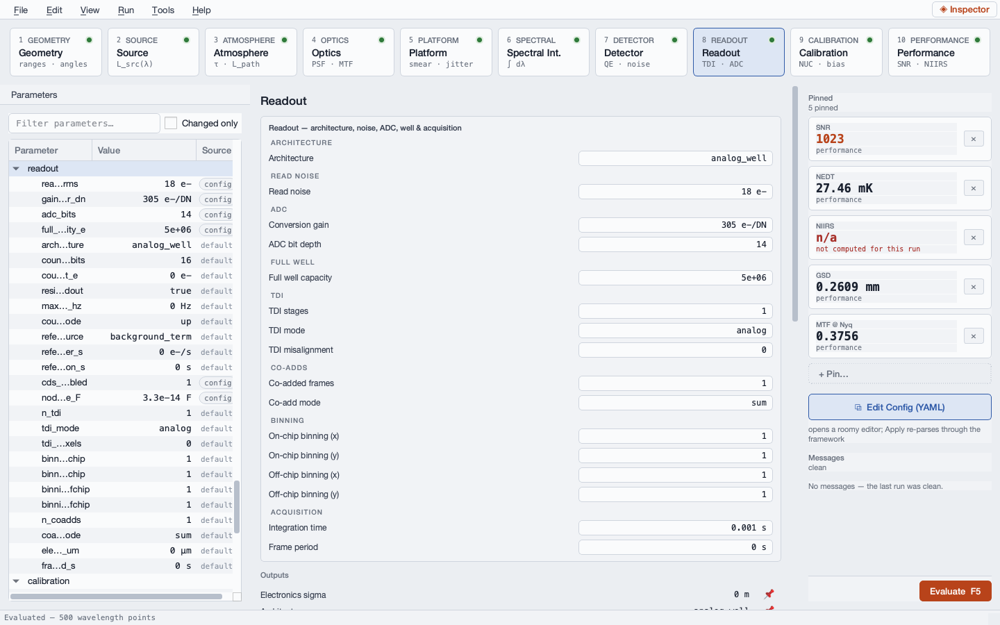
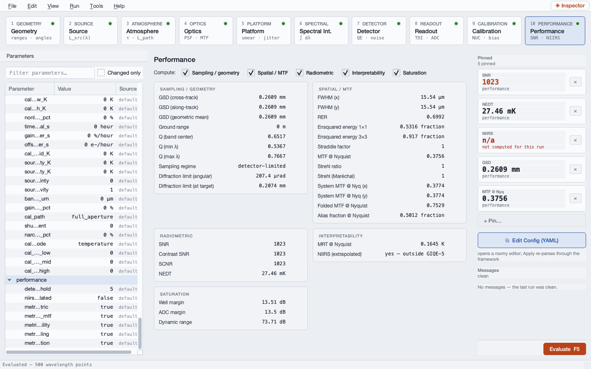

# Case Study — InSb versus HgCdTe on One Bench

**Scenario 2.1** · persona: Mike, detector engineer · modality: GUI-led · scenario
folder: `scenarios/02_mike_detector_engineer/2.1_insb_vs_hgcdte_noise_budget/`

---

## The question

Mike has to pick a focal plane for a space MWIR instrument, and two vendors have sent
him data. Not comparable data: one QE curve arrives as `wavelength_nm, QE_pct`, the
other as `lambda_um, quantum_efficiency`; both send measured dark current against
temperature as `T_K, Jdark_A_cm2`; and both quote read noise against the *same* 15 µm,
33 fF, CDS-mode ROIC — 18 e- RMS for the InSb part, 12 e- RMS for the HgCdTe part.

He wants a like-for-like noise budget on a common bench — a flat 300 K blackbody
filling the aperture, a 3.5–5.0 µm cold filter, no atmosphere, no scene — and the three
numbers that actually size the cryocooler:

- the **dark-current crossover temperature**, where dark shot noise reaches the read
  noise floor;
- the **BLIP temperature**, where the dark rate reaches the photon rate;
- the **NEI**, the noise-equivalent irradiance.

This chapter walks the bench in the GUI on the scenario's committed baseline,
`inputs/2.1_insb_vs_hgcdte_noise_budget.gui.yaml`, which carries the **InSb** branch.
The HgCdTe branch and the cooler trade are the scripted half; the closing section
points at them, and the "Running the second detector" box below says what the GUI
action is.

## The bench, and why it is what it is

| Quantity | Value | Why |
|---|---|---|
| Blackbody temperature | 300 K | A flat plate filling the aperture — the standard flat-field source. |
| Blackbody emissivity | 0.995 | Cavity source, effectively unity. |
| Bench ambient | 295 K, ε = 0.95 | The room the plate sits in. |
| Collimator aperture | 0.025 m | 2.5 cm. |
| Collimator focal length | 0.0575 m | 5.75 cm, giving f/2.3. |
| Optical transmission | 0.90 | Collimator plus window, as a scalar lump. |
| Cold filter passband | 3.5 – 5.0 µm | The common band both parts are traded in. |
| Pixel pitch | 15 µm × 15 µm | The shared ROIC. |
| Fill factor | 1 | Full-fill. |
| Node capacitance | 3.3 × 10⁻¹⁴ F | 33 fF. |
| CDS | on | kTC reset noise suppressed. |
| ROIC glow | 5 e-/s | Vendor figure. |
| Full well / gain / ADC | 5 × 10⁶ e- / 305 e-/DN / 14 bit | Shared ROIC. |
| Integration time | 0.001 s | 1 ms frame. |
| Operating temperature | 77 K | The nominal set point the trade starts from. |
| Quantum efficiency (InSb) | 0.86 | Band-average of the vendor curve over 3.5–5.0 µm. |
| Dark rate (InSb) | 280 868 e-/s at 77 K | $J(77\ \mathrm{K}) \cdot A_{pix} / q$ from the vendor table. |
| Read noise (InSb) | 18 e- RMS | Vendor CDS figure. |
| Atmosphere | `exo` | There is no atmosphere between a plate and a collimator 5 cm away. |
| Sensor altitude | 1.0 m | A bench placeholder — the chain needs a geometry, and this one is not a real one. |

The HgCdTe branch changes exactly three of those: QE 0.782, dark rate 7022 e-/s at
77 K, read noise 12 e- RMS. Everything else — optics, filter, ROIC, well, gain, frame
time — is held. That is what makes the comparison a detector comparison.

## The GUI walk

### Step 1 — Get the vendor curves in

The scenario's workflow opens with `File → Import → Detector QE Curve` and
`File → Import → Dark Current Curve`. Both are modal dialogs, outside what these
offscreen figures can show, so the figure below is the state they leave behind: the
Detector workspace on the InSb branch.


Three things on this page are worth naming.

**The FPA part library row** across the top reads `FPA part library  no part applied`,
with `Choose part & apply…` live and `Open datasheet/paper` greyed out. RADIANT ships a
library of real focal-plane presets, each traced to a datasheet line in a manifest, and
applying one writes a whole set of detector parameters at once with a `preset` badge on
each. Mike is not using one here — and that is the right call for this study, because
the whole point is to model *these two vendors' parts*, from *their* data, not a
library part that resembles them. The row is worth knowing about for the moment he
wants a sanity reference: apply a comparable preset, read the deltas, remove it again.

**The quantum-efficiency group** offers four ways in: a scalar (`Quantum efficiency
(scalar)` = 0.86 here), a `QE curve CSV (import)` path, a `QE material (library)`
name, and two buttons — `Define QE(λ) table…` for an inline wavelength/value table and
`Import QE curve (preview)…` for the vendor CSV. The importer behind that second button
resolves units from the header tokens, so `wavelength_nm` / `QE_pct` and `lambda_um` /
`quantum_efficiency` both land in canonical µm and fraction from the same call, and a
QE above 1 after conversion is a hard error naming the override rather than a silently
unphysical curve.

This baseline carries the **scalar**, 0.86 — the band-average of the InSb curve. That
choice is visible in the results and is discussed under step 4.

**The dark current** reads 280 868 1/s at a 77 K reference temperature. That is not a
datasheet number typed in; it is $J(77\ \mathrm{K})\,A_{pix}/q$ evaluated from the
vendor's measured $J_{dark}(T)$ table, with the A/cm² → e-/s conversion done once in
the loader. The loader's interpolation is Arrhenius-faithful — $\ln J$ linear in $1/T$,
exact between nodes for $J \propto e^{-E_a/kT}$ — and it refuses to extrapolate outside
the measured range. That refusal is a feature: the first run of this scenario tripped
it, because the BLIP temperatures lie above 110 K and the vendor tables stopped at 110.
The tables were extended to 130 K rather than extrapolated through.

### Step 2 — Check the shared ROIC

Select stage **8 Readout**.



Architecture `analog_well`; read noise 18 e-; conversion gain 305 e-/DN over 14 bits;
full well 5 × 10⁶ e-; TDI stages 1 in `analog` mode with zero misalignment; one
co-added frame; no binning on or off chip; integration time 0.001 s. In the Parameters dock,
`cds_enabled` = 1 and `node_capacitance_F` = 3.3 × 10⁻¹⁴ both carry `config` badges.

Two of those numbers are about to matter. **305 e-/DN is 5 Me- spread over 14 bits**,
and a uniform quantizer contributes $g/\sqrt{12} = 88$ e- RMS regardless of how quiet
the detector is. **CDS on** means the reset noise $\sqrt{k_B T C}/q$ — 37.0 e- RMS at
33 fF and 77 K by hand — is suppressed, and the noise budget will report
`ktc_reset` = 0 rather than quietly omitting it.

### Step 3 — Read the noise budget

Select stage **7 Detector**, tab **Noise**.


| Term | σ [e- RMS] | Comment |
|---|---:|---|
| `signal_shot` | 1027 | $\sqrt{S}$ — dominant by a factor of twelve. |
| `quantization` | 88.05 | $g/\sqrt{12}$ at 305 e-/DN. |
| `read_noise` | 18 | Vendor CDS figure. |
| `dark_shot` | 16.76 | $\sqrt{280\,868 \times 0.001}$. |
| `glow_shot` | 0.0707 | 5 e-/s of ROIC glow over 1 ms. |
| `ktc_reset` | 0 | Suppressed by CDS, as configured. |
| `background_shot` | 0 | Zero **by design** — see below. |
| **Total (RSS)** | **1032** | |

`background_shot = 0` is the entry that looks like a bug and is not. In the extended
regime the scene *is* the source — a 300 K plate filling the aperture — so there is no
separate background photon population to add on top of it. The bench-ambient
temperature in the config feeds the contrast scene, not a second shot term. The
signal-integration stage's own outputs say the same thing in numbers:
`signal_e` = 1 055 678 e-, `background_e` = 0, `contrast_e` = 1 055 678 e-, which is why
SNR, contrast SNR and SCNR will all read the same value on the Performance page.

**The headline for the cooler budget: at 77 K the dark current is irrelevant.** Dark
shot noise is 16.76 e- RMS against 1027 e- RMS of photon noise. The 40× dark-current
advantage HgCdTe holds over InSb — 7022 e-/s against 280 868 e-/s — buys essentially
nothing *at this set point on this bright bench*. The trade at 77 K is a QE trade, and
InSb wins it.

**The second-largest term is the ADC, not the detector.** Quantization at 88.05 e- RMS
is five times the read noise and five times the dark shot noise. On this bench it is
invisible — 88 e- against 1032 e- is 0.4 % in quadrature — but on a low-background
scene it becomes the floor, and no detector choice can move it. That is a question for
the ROIC vendor (a low-gain or dual-gain mode), not for the detector vendor.

### Step 4 — Read the result

Select stage **10 Performance**.



**Radiometric.** SNR 1023, contrast SNR 1023, SCNR 1023, NEDT 27.46 mK. The three SNR
flavours coincide because `contrast_e` equals `signal_e`, as step 3 explained.

**Spatial / MTF.** FWHM 15.54 µm, RER 0.6992, ensquared energy 0.5316 in the central
pixel and 0.917 over 3 × 3, MTF at Nyquist 0.3756, folded MTF 0.7529, alias fraction
0.5012, Strehl 1. $Q$ = 0.6517 at band centre, classified `detector-limited` — an f/2.3
collimator at 4.25 µm blurs to well under a 15 µm pixel, which is what a bench is
supposed to do.

**Sampling / geometry — do not read this group.** GSD reads 0.2609 mm in both axes and
the diffraction limit "at target" reads 0.2074 mm. Those are honest arithmetic on a
placeholder: $p\,h/f = 15\ \mu\mathrm{m} \times 1.0\ \mathrm{m} / 0.0575\ \mathrm{m} =
0.2609$ mm, where the 1.0 m is the bench stand-in for a sensor altitude. There is no
ground plane in a laboratory, and the ground-projection family means nothing here. The
tool does refuse the one metric it can refuse: the pinned NIIRS card reads
`n/a — not computed for this run`, and the Interpretability group carries only MRT at
Nyquist (0.1645 K) plus the `yes — outside GIQE-5` flag. A dedicated detector-only bench
mode, which would switch the whole family off the way an air target does, is a tracked
gap.

**Saturation.** Well margin 13.51 dB, ADC margin 13.50 dB, dynamic range 73.71 dB. The
margin is $20\log_{10}$ of capacity over filled charge, so 13.51 dB is a factor of 4.74:
the 1 ms frame fills about a fifth of the 5 Me- well — 1 055 678 e- of 5 × 10⁶ e-, which
is the signal-integration output step 3 quoted.

> **Running the second detector.** The committed GUI baseline is the InSb branch. In
> the window, the HgCdTe branch is three edits in the Parameters dock —
> `detector.qe_value` 0.86 → 0.782, `detector.dark_rate_e_per_s` 280 868 → 7022,
> `readout.read_noise_e_rms` 18 → 12 — after which the window re-evaluates on its
> debounce and the Noise tab redraws. To see both at once rather than one after the
> other, save the edited version and use `Tools → Compare Config Files…`, which
> evaluates the current config plus any number of added files on a worker thread and
> lays the metrics out as one table. (The multi-configuration surface —
> `Edit → Configurations…` — is the other option, and the right one when the two
> versions are genuinely one instrument; here they are two different focal planes in
> one dewar, which is a file comparison.)

## What the study concludes

The scenario's runner evaluates both detectors with their **spectral** QE curves rather
than a band-averaged scalar, and reports:

| Term | InSb [e- RMS] | HgCdTe [e- RMS] |
|---|---:|---:|
| `signal_shot` | 1033.69 | 985.31 |
| `quantization` | 88.05 | 88.05 |
| `read_noise` | 18.00 | 12.00 |
| `dark_shot` | 16.76 | 2.65 |
| `glow_shot` | 0.07 | 0.07 |
| **Total (RSS)** | **1037.73** | **989.32** |
| Signal [e-] | 1 068 522 | 970 841 |
| SNR | 1029.7 | 981.3 |

and, from the exact Arrhenius inversion of the vendor tables rather than a temperature
sweep:

| Quantity | InSb | HgCdTe |
|---|---:|---:|
| Dark rate at 77 K [e-/s] | 280 868 | 7 022 |
| Crossover temperature [K] | 77.3 | 84.1 |
| BLIP temperature [K] | 101.7 | 115.4 |
| NEI [photons/s/cm²] | 5.363 × 10¹¹ | 5.620 × 10¹¹ |

**The GUI baseline is the InSb scalar-QE branch, and it reproduces the runner's own
scalar column exactly.** The runner reports scalar-QE signal 1 055 678 e- against
spectral 1 068 522 e- (+1.22 %), and $\sqrt{1\,055\,678} = 1027.5$ — the 1027 e- RMS on
the figure above. Carried through, that is SNR 1023 in the window against SNR 1029.7 in
the spectral run. The gap is not a disagreement: it is the price of a band-averaged QE.
A flat average cannot know that the in-band photons concentrate at the long-wavelength
end, where both vendors' curves are near their peaks, so it under-counts by about a
percent here — and by much more for a steeper QE slope or a wider band.

The verdict the trade produces:

- **At 77 K both parts are photon-noise-dominated**, so the SNR ratio is just the
  $\sqrt{\text{signal}}$ ratio, which tracks the QE ratio. InSb's higher, flatter QE
  (0.860 against 0.782 band-averaged) buys about 10 % more signal and about 5 % more
  SNR. The 40× dark-current difference does not appear.
- **The parts separate at warmer set points.** HgCdTe's dark shot noise reaches the
  read-noise floor at 84.1 K against 77.3 K for InSb, and it stays
  background-limited to 115.4 K against 101.7 K. That 7–14 K of set-point margin is
  cryocooler mass, power and lifetime at the system level — the classic InSb
  (QE and uniformity) versus HgCdTe (operability margin) trade, with vendor-derived
  numbers under it.
- **Quantization is the number-two noise term on both**, and it belongs to the ROIC.
  Fix it in the gain plan, not in the detector choice.

## The same study from a script

```bash
python scenarios/02_mike_detector_engineer/2.1_insb_vs_hgcdte_noise_budget/scripts/run_detector_shootout.py
```

The runner loads all four vendor CSVs through `radiant.io.qe_csv.load_qe_csv` and
`radiant.io.dark_current_csv.load_dark_current_csv`, runs each detector twice — once
with the spectral QE curve injected onto the chain grid, once with the band-averaged
scalar — inverts the dark-current curves for the crossover and BLIP temperatures, and
writes the noise-budget and cooler-trade sheets plus four figures into `outputs/`.
`scripts/gui_console_2.1_insb_vs_hgcdte_noise_budget.py` is the same work as a paste-in
for the GUI's scripting console.

The vendor-import details, the kTC hand cross-check, and the gap list are in the
scenario's own `walkthrough.md`.
