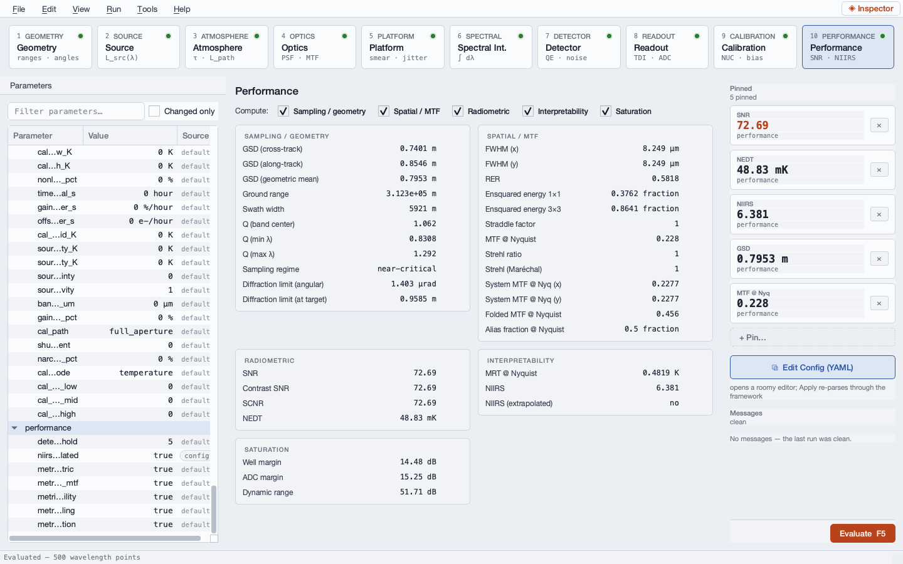

# Case Study — ISR Pass Planning

**Scenario 3.1** · persona: Raj, collection planner · modality: GUI-led · scenario
folder: `scenarios/03_raj_mission_planner/3.1_isr_pass_planning/`

---

## The question

Raj tasks a sun-synchronous imager and has to defend a collection plan in a tasking
review. The spacecraft flies at 600 km, can slew 45° off nadir, and the customer
will not accept imagery below NIIRS 6.0. Three questions come out of that:

1. What are the orbit kinematics — period, ground speed, revisit rate — that set how
   often the target is reachable at all?
2. How far off nadir can he point before image quality falls below the floor, and how
   wide is the resulting access corridor?
3. What area can the spacecraft cover per unit time?

The third one is the reason this scenario exists as a *composition* rather than a
single chain run. The RADIANT signal chain has no concept of platform velocity, so it
cannot produce a coverage rate on its own. The orbit model supplies the ground-track
speed; the chain supplies the swath; `performance.access_rate` multiplies them.

This chapter walks the image-quality half in the GUI on the scenario's committed
baseline, `inputs/3.1_isr_pass_planning.gui.yaml`, which is the 30° off-nadir
nominal look. The angle sweep and the orbit arithmetic are the scripted half.

## The system, and why it is what it is

| Quantity | Value | Why |
|---|---|---|
| Sensor altitude | 600,000 m | The mission orbit. |
| Path zenith angle | 30° | The nominal look this baseline evaluates; the study sweeps 0–45°. |
| Solar zenith angle | 35° | A mid-morning sun-synchronous descending pass. |
| Aperture diameter | 0.50 m | The instrument. |
| Focal length | 6.0 m | f/12 — a long-focal-length imager, as a sub-meter GSD needs. |
| Optical transmission | 0.85 | Scalar lump. |
| Spectral band | 0.45–0.70 µm | Panchromatic visible. |
| Integration time | 0.0005 s | 0.5 ms — a fast pushbroom line time. |
| Pixel pitch | 6.5 µm × 6.5 µm | Silicon detector. |
| Cross-track pixel count | 8000 | The array width — this is what sets the swath. |
| Quantum efficiency | 0.85 | Silicon in the visible. |
| Target reflectance | 0.30 | A generic land scene. |
| Dark rate | 50 e-/s at 280 K | Room-temperature silicon; negligible at 0.5 ms. |
| Full well / gain / ADC | 30,000 e- / 8 e-/DN / 12 bit | A small-well visible ROIC. |
| Read noise | 20 e- RMS | Typical CMOS. |
| Atmosphere | parametric, `us_standard` | No specific site; the generic column. |
| Collection constraints | slew ≤ 45°, NIIRS ≥ 6.0 | The tasking rules the plan has to satisfy. |

The two collection constraints are not RADIANT parameters — they are the customer's
rules. What RADIANT supplies is the curve they are applied to.

## The GUI walk

### Step 1 — Describe the look

Select stage **1 Geometry**, tab **Inputs**.


The scene-class card derives `Scene: space → ground (space_to_ground)`, and only the
three target-plane sample distances default off — a ground scene wants every
ground-projection metric there is, which is exactly what a collection planner is after.

The viewing family is in mode **V1**, `Path zenith at lower endpoint`. Raj entered
`sensor_altitude_m` = 600,000 m and `path_zenith_rad` = 30 deg; `ground_range_m`,
`target_range_m`, `elevation_angle_rad` and `sensor_off_boresight_rad` are grayed
because this mode derives all four. That grayed-not-hidden idiom matters for a planner:
the alternatives stay visible, so it is obvious that a pointing plan expressed as a
*ground range* rather than an angle is available in another mode of the same family,
not in another tool.

Solar geometry sits in mode **S1**, `Solar zenith θ_s`, at 35 deg with
`solar_illumination` = `day`. For a reflective-band scene that is not decoration: it
sets the irradiance the 0.30-reflectance surface is lit by, and it moves SNR directly.

### Step 2 — Look at the geometry, not the numbers

Switch to the **Schematic** tab.


The orthographic schematic draws the sensor above and to one side of the target, the
sun vector in orange, and the sensor line of sight in blue. It is deliberately **not to
scale**: 600 km against a 6371 km Earth radius drawn honestly would put the sensor
inside the target marker. Altitude is therefore *told*, via the `h_s 600 km` leader
pill, while the geometry stays legible.

The **ANGLES** panel in the lower left is the part a planner uses. Each of
$\theta_s$ (sun zenith), $\Delta\phi$ (relative azimuth), $\alpha_t$ (phase angle),
$\theta_o$ (path zenith), $\zeta_{low}$ (lower-endpoint zenith) and $\eta$ (off-nadir)
is an individually revealable arc, unchecked here. They are separate toggles rather
than one "show angles" switch because the angles differ from each other by fractions of
a degree at LEO, and drawing all six at once is unreadable. Ticking $\theta_o$ and
$\eta$ together is the quickest way to see that the 30° the config names at the
*target* is not the 30° the spacecraft slews through at the *sensor* — they differ
by the Earth-center central angle.

The mode form is repeated on the right of this tab, so a pointing change can be made
without leaving the picture: edit `path_zenith_rad` there and the schematic and the
metrics both move on the next debounce.

### Step 3 — Read the four numbers the plan is argued from

Select stage **10 Performance**.



**Sampling / geometry** is the group a collection planner lives in:

| Metric | Value |
|---|---|
| GSD (cross-track) | 0.7401 m |
| GSD (along-track) | 0.8546 m |
| GSD (geometric mean) | 0.7953 m |
| Ground range | 3.123 × 10⁵ m |
| Swath width | 5921 m |
| $Q$ (band center) | 1.062 |
| Sampling regime | near-critical |
| Diffraction limit (angular) | 1.403 µrad |
| Diffraction limit (at target) | 0.9585 m |

Three of those carry the whole argument. **Ground range 312 km** is how far
cross-track this one look reaches — that is the corridor coordinate. **Swath width
5921 m** is 8000 pixels of 0.7401 m cross-track GSD, and it is what will multiply the
ground-track speed into a coverage rate. And the **GSD ratio**,
$0.8546/0.7401 = 1.155 = 1/\cos 30^\circ$, is the obliquity stretch: a 30° look
lengthens the footprint in the plane of the tilt by exactly the secant, and leaves the
perpendicular axis alone.

$Q = 1.062$ with the `near-critical` label is a well-matched instrument. $Q = \lambda
F/\# / p$ compares optical blur to pixel; at 1 the optics and the sampling are balanced,
below 1 the pixels throw away resolution the optics delivered, above 1 the optics blur
below what the pixels could sample. A 0.5 m aperture at f/12 on 6.5 µm pixels lands at
1.06 — the diffraction limit projects to 0.9585 m at the target against a 0.7953 m
sample, which is the same statement.

**Spatial / MTF.** FWHM 8.249 µm, RER 0.5818, ensquared energy 0.3762 in the central
pixel and 0.8641 over 3 × 3, MTF at Nyquist 0.228, folded MTF 0.456, alias fraction
0.5, Strehl 1. The folded value is exactly twice the unfolded one and the alias
fraction is exactly 0.5: at Nyquist the first sampling replica lands back on Nyquist,
so half the apparent contrast there is folded-in above-Nyquist scene content.

**Radiometric.** SNR 72.69, contrast SNR 72.69, SCNR 72.69, NEDT 48.83 mK. The three
coincide because the scene is a uniform reflective surface with no separate clutter or
contrast term.

**Interpretability.** MRT at Nyquist 0.4819 K, **NIIRS 6.381**, and
`NIIRS (extrapolated): no` — this GSD is inside the GIQE-5 calibration range, so the
rating is a real one rather than an extrapolated trend. At 30° the look clears the
6.0 floor by 0.38.

**Saturation.** Well margin 14.48 dB, ADC margin 15.25 dB, dynamic range 51.71 dB. The
margin is $20\log_{10}$ of capacity over filled charge, so 14.48 dB is a factor of 5.3 —
the 30,000 e- well is about a fifth full on a 0.30-reflectance scene. Enough here, and
worth watching over bright desert or cloud.

### Step 4 — Sweep the pointing angle

The single look above answers one question. The plan needs the curve.


The dock, widened so the full dot-paths are legible, shows what will be swept and what
will follow it. `geometry.path_zenith_rad` reads 30 deg with a `config` badge;
`sensor_altitude_m` 600,000 m and `solar_zenith_rad` 35 deg are the other two `config`
rows and are held. Everything grayed — `target.projected_area_m2`, the whole
`target.shape.*` family — belongs to target-extent modes this extended scene does not
use.

`Run → Run Sweep…` takes a parameter, a start, a stop, a point count and a metric, and
evaluates on a worker thread so the window stays responsive. Parameter
`geometry.path_zenith_rad`, 0 to 45 deg, 16 points, metric `niirs` reproduces the
scenario's own trade. The metric list is populated from what the last evaluation
actually produced, so a metric this configuration does not compute cannot be selected
by accident.

The result, from the scenario's runner over the same range:

| Off-nadir [deg] | GSD [m] | NIIRS | SNR | Ground range [km] | Swath [km] |
|---:|---:|---:|---:|---:|---:|
| 0 | 0.65 | 6.67 | 72.0 | 0 | 5.2 |
| 15 | 0.68 | 6.60 | 72.8 | 146 | 5.4 |
| 30 | 0.80 | 6.38 | 72.7 | 312 | 5.9 |
| 45 | 1.05 | 5.97 | 71.3 | 527 | 7.1 |

The 30° row is the baseline this chapter evaluated, and the GUI's own numbers —
GSD 0.7953 m, NIIRS 6.381, SNR 72.69, ground range 3.123 × 10⁵ m, swath 5921 m — are
that row at full precision.

## What the study concludes

**Orbit kinematics**, from `radiant.core.orbit` on a 600 km circular orbit: period
5792 s (96.5 min), inertial velocity 7.56 km/s, sub-satellite ground-track speed
6.91 km/s, 14.9 orbits per day. The ground-track speed is below the orbital speed by
the factor $R_E/a$ — the nadir point traces a circle of radius $R_E$ while the
spacecraft traces one of radius $a = R_E + h$. Earth rotation is neglected, which is a
few-percent direction-dependent cross-term at LEO and adequate for coverage sizing.

**Coverage**, composed from the two halves: nadir swath 5.2 km × 6.91 km/s gives an
area-coverage rate of **35.9 km²/s**, or roughly 104,000 km² per daylight pass.

**The corridor, and the planning verdict.** NIIRS falls monotonically with off-nadir
angle — 6.67 at nadir to 5.97 at 45° — and crosses the 6.0 floor at **42°**. The
spacecraft can *slew* to 45°, reaching 527 km cross-track, but it can only *image at
spec* out to 42°, which is a 478 km half-width. **Image quality, not agility, sets
the usable access corridor**, and the last 3 degrees of slew buy reach the imagery
cannot use.

Two mechanisms are worth separating, because they run opposite ways:

- **GSD grows with off-nadir angle** roughly as $1/\cos^2$ — one factor from the
  lengthening slant range, one from the projection stretch — and drags NIIRS down with
  it through the GIQE-5 resolution term.
- **SNR *rises* slightly off nadir**, from 72.0 at nadir to 72.8 at 15°, before
  easing to 71.3 at 45°. The ground footprint per pixel grows faster than the
  slant-range path loss costs, so each pixel collects more photons from a sunlit
  extended scene. Image quality still degrades, because resolution and not SNR is the
  binding term: the GIQE-5 SNR contribution is $1.559\log_{10}(\mathrm{SNR})$, so a 2 %
  SNR change is 0.013 NIIRS against the 0.42 the slew itself costs.

A caveat for the far end of the sweep: above about 42° the GSD passes outside the
GIQE-5 calibration range and NIIRS extrapolation warnings fire. The runner opts into
the extrapolated trend deliberately, and those tail values should be read as a relative
trend. The floor crossing at 42° is inside the calibrated range, so the verdict does
not rest on an extrapolation.

The regime throughout is **extended**: the sunlit surface fills the pixel, and the
point-source and sub-pixel machinery — ensquared-energy application to a target term,
angular-extent checks — is unused.

## The same study from a script

```bash
cd scenarios/03_raj_mission_planner/3.1_isr_pass_planning
python scripts/run_pass_planning.py
```

The runner reads the mission constants transcribed from `inputs/raj_orbit_sensor.xlsx`,
calls `radiant.core.orbit` for the kinematics, walks 16 pointing angles from 0 to
45° through the chain, finds the NIIRS-floor crossing, composes the coverage rate
through `radiant.performance.access_rate.compute_access_rate_m2_s`, and writes
`outputs/fig1_offnadir_image_quality.png` and `outputs/fig2_access_corridor.png`.
`scripts/gui_console_3.1_isr_pass_planning.py` is the same work as a paste-in for the
GUI's scripting console, where the orbit helpers are one-liners:

```python
from radiant.core.orbit import ground_track_speed_m_s, orbital_period_s
orbital_period_s(600e3) / 60        # 96.54 min
ground_track_speed_m_s(600e3)       # 6910.9 m/s
```

The orbit-model truth anchors, the access-corridor derivation, and the gap list — a
target-specific revisit model is the main one — are in the scenario's own
`walkthrough.md`.
