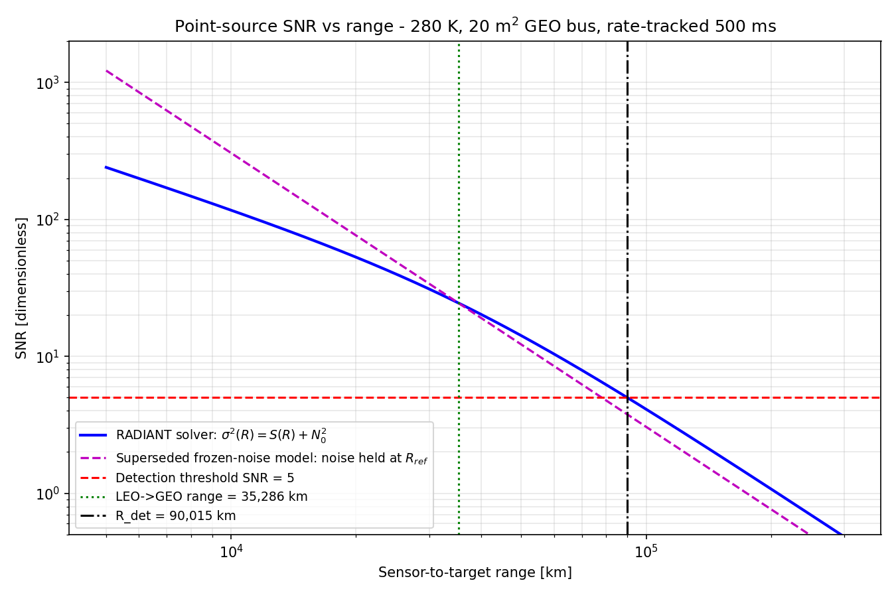
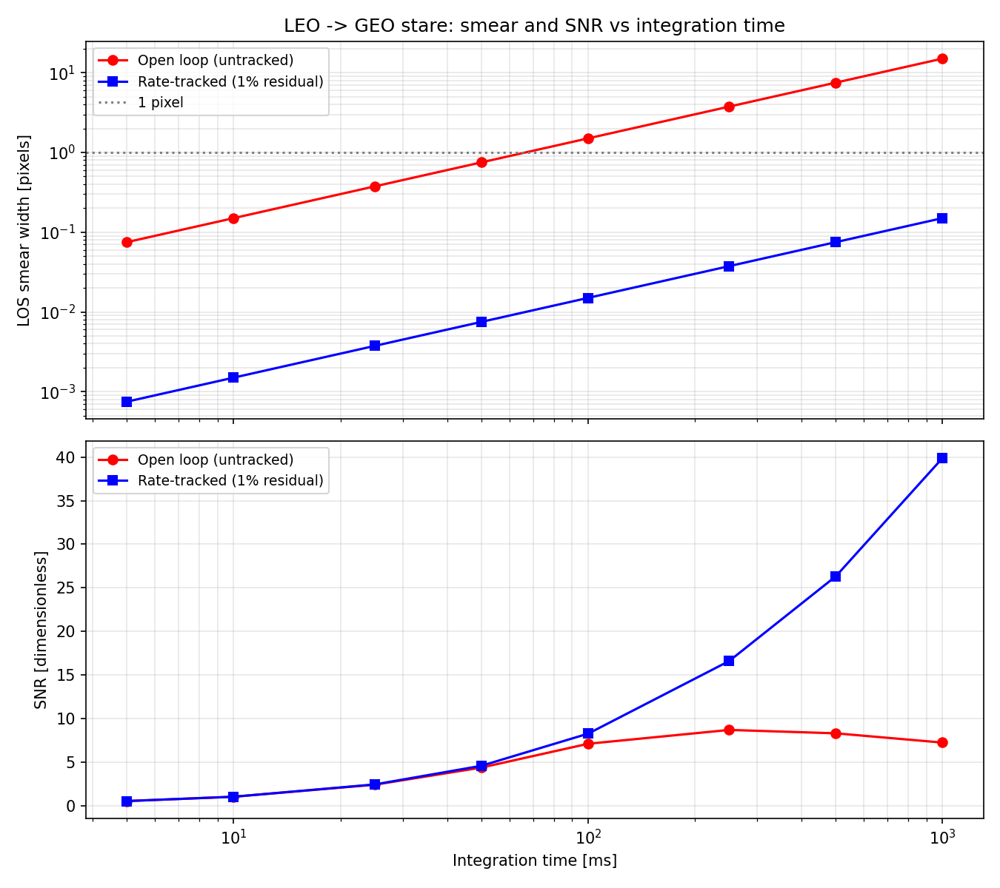
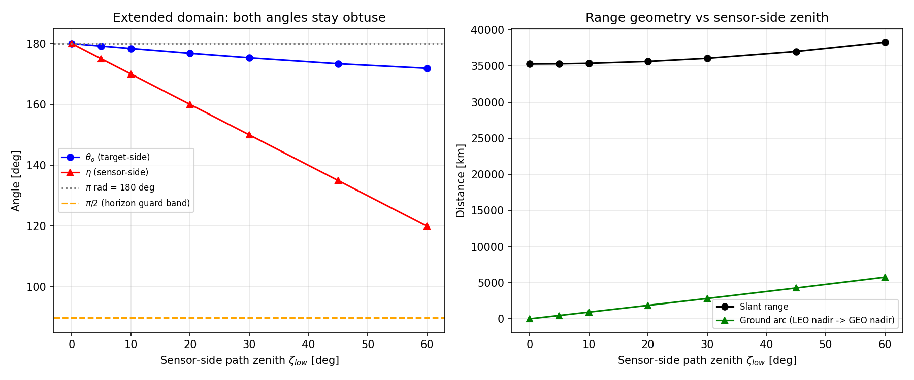

# Scenario 10.4 — LEO → GEO up-looking space-to-space SDA

**Series:** 10 — Direction-general geometry (ADR-0011 validation)
**Scene class:** `space_to_space`, LOS direction `up`
**Persona:** Raj (mission planner), wearing a space-domain-awareness hat
**Runner:** `scripts/run_leo_to_geo_exo.py` (runtime ≈ 16 s)
**Factory for the GUI baseline:** `make_sensor() -> radiant.api.Sensor`

---

## 1. The problem

A 500 km LEO host carries a 35 cm MWIR staring telescope pointed *up* at the
geostationary belt. Raj needs three numbers before he can size a
space-domain-awareness (SDA) tasking plan:

1. Can the sensor detect a reference GEO communications bus in eclipse, and at
   what single-frame SNR?
2. How far past GEO does that detection capability extend?
3. What does the LEO-versus-GEO relative angular rate do to the achievable
   integration time — i.e. does the payload have to rate-track, or can it stare?

This scene is also the **Geometry-Flexibility Phase-1 quick win** (ADR-0011,
plan §4). Before Phase 1 it could not be *expressed*:
`core/viewing_triangle.py` rejected `h_sensor <= h_target` and the canonical
target-side path zenith $\theta_o$ was bounded to $[0, \pi/2)$. The physics was
never the blocker — both endpoints sit above `h_atm_top`, so the whole path is
vacuum by construction and the exo backend already handled the composition. The
altitude-ordering gate was the only thing in the way. This scenario is the
validation that the gate is gone and the answer is right.

---

## 2. The system

Inputs arrive as a vendor workbook, `inputs/sda_leo_to_geo_sensor_data.xlsx`
(generated by `inputs/create_spreadsheet.py`), in vendor units. The runner
performs every conversion to canonical units exactly once, each with an inline
comment.

### 2.1 Telescope (vendor: mm, %, °C)

| Parameter | Vendor value | Canonical | Note |
|---|---|---|---|
| Entrance pupil diameter | 350 mm | 0.35 m | Cassegrain primary |
| Effective focal length | 2100 mm | 2.1 m | f/6.0 |
| Central obscuration | 25 % | 0.25 | Secondary + baffle, linear ratio |
| Optical transmission (in band) | 60 % | 0.60 | 6 surfaces + cold filter |
| WFE RMS | 0.05 waves | 0.05 waves | At 4.25 µm, on-axis, EOL |
| Optical bench temperature | −93.15 °C | 180 K | Radiatively cooled aft optics |

### 2.2 FPA (vendor: µm, %, ke-, ms, nm)

| Parameter | Vendor value | Canonical | Note |
|---|---|---|---|
| Pixel pitch | 18 µm | 18 µm | Square; IFOV = 8.571 µrad |
| Quantum efficiency | 75 % | 0.75 | Band-averaged |
| Dark current | 1000 e-/s | 1000 e-/s | At 80 K |
| Read noise | 25 e- RMS | 25 e- RMS | CDS |
| Full well capacity | 100 ke- | 1.0 × 10⁵ e- | High-flux node |
| ADC / gain | 14 bits, 6.1 e-/DN | — | Matched: full well / 2¹⁴ |
| Integration time | 500 ms | 0.5 s | Rate-tracked stare |
| Spectral band | 3500–5000 nm | 3.5–5.0 µm | Cold filter |

### 2.3 Mission geometry and target signature

| Parameter | Vendor value | Canonical | Note |
|---|---|---|---|
| Sensor orbit altitude | 500 km | 5.0 × 10⁵ m | Circular LEO |
| Target orbit altitude | 35 786 km | 3.5786 × 10⁷ m | Geostationary belt |
| Sensor-side path zenith $\zeta_\mathrm{low}$ | 0° | 0 rad | Entered at the **lower** endpoint (ADR-0011 decision 3) |
| Illumination | night | — | Target in Earth eclipse: thermal only |
| Declared scene class | `space_to_space` | — | Optional ADR-0011 assertion |
| Rate-track residual | 1 % | 0.01 | Uncompensated fraction of the open-loop LOS rate |
| Detection SNR threshold | 5 | 5 | Single-frame |
| Projected area | 20 m² | 20 m² | 3.2 × 2.4 m bus body + edge-on wing structure |
| Mean surface temperature | 6.85 °C | 280 K | Eclipse-cooled MLI/radiator mix |
| Broadband emissivity | 0.85 | 0.85 | Area-weighted MLI Kapton / OSR radiator |

**Target-model assumptions, stated explicitly.** The GEO bus is modelled as a
single-temperature grey body: $T = 280$ K, $\varepsilon = 0.85$, projected area
20 m². 280 K is a mid-eclipse average for a bus whose MLI has cooled from its
sunlit ~300 K while the internally-heated radiator panels stay warmer; 20 m² is
a large communications platform seen from below, with the solar wings nearly
edge-on. A real signature is multi-temperature and aspect-dependent; this is a
deliberate single-temperature sizing model, and every number below scales
linearly in $\varepsilon A$ and steeply (roughly $T^{8}$ in-band at 280 K
across 3.5–5.0 µm) in temperature.

---

## 3. Approach

The runner does five things, in order:

1. **Nominal run** — vertical up-look, 500 ms, rate-tracked. Publishes the scene
   class, the direction-general angles, and the headline metrics.
2. **Identity proofs** — the vacuum transport identities and the analytic
   geometry, both checked as *exact* rather than toleranced.
3. **Kinematics** — LEO and GEO circular-orbit rates from `radiant.core.orbit`,
   the resulting LOS rate, and its entry through both Gap 111 doors.
4. **Integration-time trade** — SNR and smear for the rate-tracked and
   open-loop (untracked) cases across 5–1000 ms.
5. **Sensor-side zenith sweep** — the near-$\pi$ geometry family from
   $\zeta_\mathrm{low} = 0°$ to $60°$.

Chain stages exercised: geometry → source → atmosphere (exo/vacuum) → optics →
platform → spectral integration → detector → readout → performance.

---

## 4. Key results

### 4.1 Scene class and direction-general geometry

```
Derived scene class            : space_to_space
Asserted (geometry.scene_class): space_to_space  -> agreed
Observer band / target band    : space / space
LOS direction (derived)        : up
Viewing mode                   : geometry.path_zenith_rad
                                 (up-looking — angle at the sensor, the lower endpoint)

theta_o (target-side zenith)   : 3.141592654 rad = 180.000000 deg
eta     (sensor-side off-nadir): 3.141592654 rad = 180.000000 deg
zeta_low (zenith at LEO sensor): 0.000000000 rad =   0.000000 deg
Slant range                    : 35,286,000.0 m = 35,286.000 km
Ground range (surface arc)     :        0.000000 m
Incidence angle at target      :      180.000000 deg
```

The scene class is **derived** from the altitude pair; the optional
`geometry.scene_class = "space_to_space"` assertion is validated against that
derivation (CU-093 redundant-entry pattern) and agrees. Physics never branches
on the class — it only steers defaults, metric relevance, validation and GUI
composition (ADR-0011 decision 8).

$\eta = \pi$ deserves a word, because it looks odd. $\eta$ is the sensor-side
angle from the sensor's **nadir**. With the GEO bus at the LEO sensor's zenith,
the target direction is exactly anti-nadir, so $\eta$ lands on the obtuse branch
at $\pi$. The quantity a telescope operator actually points with is
$\zeta_\mathrm{low} = \pi - \eta = 0$: point at your own zenith. This is the same
transform the GUI schematic's angle catalog uses
(`gui/viewer/angle_catalog.lower_zenith_rad`), and it is *not* $\pi - \theta_o$
— $\theta_o$ and $\eta$ are read at different vertices of the same spherical
triangle.

### 4.2 Radiometry, SNR and detection range

| Quantity | Value | Unit |
|---|---:|---|
| EE_box (1×1, from the fully degraded PSF) | 0.223197 | — |
| In-pixel signal | 1 177.25 | e- |
| signal shot noise | 34.311 | e- RMS |
| dark shot noise | 22.361 | e- RMS |
| read noise | 25.000 | e- RMS |
| quantization noise | 1.761 | e- RMS |
| **Total noise** | **48.014** | e- RMS |
| **SNR** | **24.52** | — |
| **Detection range** (SNR = 5) | **90 015** | km |
| NEDT (reported, but not a meaningful figure of merit here — see below) | 1005 | mK |

NEDT is printed because the metric layer computes it, but it should not be read
as a figure of merit for this scene: NEDT is a *radiance-contrast* sensitivity
defined against a scene that fills the pixel, and this target fills 0.02 % of
one. The meaningful sensitivity statement here is the SNR / detection-range
pair.

Background shot noise is **exactly zero**: the up-looking LOS never returns to
Earth, so past the GEO bus it exits into deep space and the background is
`ColdSpaceBackground` with identically zero radiance. This is the LOS-termination
rule of ADR-0011 decision 9 in action — hits Earth → ground, exits the
atmosphere → cold space, grazes the limb → raise.

Detection range is 2.55× the LEO→GEO range: the geostationary belt sits
comfortably inside this sensor's single-frame detection horizon for the assumed
signature. (It was 2.21× before CU-263 fixed the frozen-noise criterion on
2026-08-01 — see cross-check 4.)



### 4.3 Relative kinematics and the smear consequence

| Quantity | Value | Unit |
|---|---:|---|
| LEO (500 km) inertial speed | 7 616.56 | m/s |
| LEO orbital rate | 1 108.508 | µrad/s |
| LEO period | 94.469 | min |
| GEO (35 786 km) inertial speed | 3 074.92 | m/s |
| GEO orbital rate | 72.940 | µrad/s |
| GEO period | 23.9284 | h |
| **Open-loop LOS rate** | **128.709** | **µrad/s** |
| Focal-plane smear at 500 ms, open loop | 135.14 µm = **7.508** | px |
| Focal-plane smear at 500 ms, 1 % residual | 1.3514 µm = 0.07508 | px |

Both satellites move tangentially, hence perpendicular to the radial line of
sight, so the LOS rate is the *difference* of the tangential speeds over the
separation:

$$\omega_\mathrm{LOS} = \frac{|v_\mathrm{LEO} - v_\mathrm{GEO}|}{h_\mathrm{GEO} - h_\mathrm{LEO}}
 = \frac{7616.56 - 3074.92 \ \mathrm{m/s}}{3.5286\times10^{7}\ \mathrm{m}} = 128.709\ \mu\mathrm{rad/s}.$$

That rate is the design driver. An inertially-fixed 500 ms stare drags the point
source across **7.5 pixels**, collapsing EE_box from 0.223 to 0.054 and SNR from
24.5 to 7.6. Open-loop SNR actually *peaks* at 250 ms and then falls: past that
point the smear kernel grows faster than $\sqrt{t}$, so integrating longer loses
SNR. The rate-tracked curve keeps rising as $\sqrt{t}$ because the scene is
background-free (cold space) and dark-current-limited.



| $t_\mathrm{int}$ [ms] | smear OL [px] | SNR OL | EE OL | smear RT [px] | SNR RT | $R_\mathrm{det}$ RT [km] |
|---:|---:|---:|---:|---:|---:|---:|
| 5 | 0.075 | 0.46 | 0.2232 | 0.00075 | 0.46 | < R_GEO |
| 25 | 0.375 | 2.17 | 0.2198 | 0.00375 | 2.21 | < R_GEO |
| 50 | 0.751 | 3.98 | 0.2123 | 0.00751 | 4.17 | < R_GEO |
| 100 | 1.502 | 6.51 | 0.1877 | 0.01502 | 7.59 | 44 507 |
| 250 | 3.754 | **7.97** | 0.1025 | 0.03754 | 15.37 | 67 430 |
| 500 | 7.508 | 7.61 | 0.0542 | 0.07508 | **24.52** | **90 015** |
| 1000 | 15.016 | 6.61 | 0.0274 | 0.15016 | 37.31 | 116 869 |

`< R_GEO` is not a crash and not a NaN: the metric layer's result-typed failure
(ADR-B / Rule 17 carve-out) reports that the SNR at the GEO range is already
below threshold, so no longer range exists at which the target becomes
detectable.

### 4.4 The near-$\pi$ geometry family



| $\zeta_\mathrm{low}$ [°] | $\theta_o$ [°] | $\eta$ [°] | slant [km] | ground arc [km] | SNR |
|---:|---:|---:|---:|---:|---:|
| 0 | 180.00000 | 180.00000 | 35 286.00 | 0.00 | 24.52 |
| 5 | 179.18608 | 175.00000 | 35 307.89 | 465.47 | 24.50 |
| 10 | 178.37819 | 170.00000 | 35 373.50 | 931.61 | 24.43 |
| 20 | 176.80442 | 160.00000 | 35 634.82 | 1 868.57 | 24.16 |
| 30 | 175.32561 | 150.00000 | 36 066.32 | 2 816.08 | 23.73 |
| 45 | 173.38204 | 135.00000 | 37 017.56 | 4 267.89 | 22.82 |
| 60 | 171.88560 | 120.00000 | 38 299.43 | 5 769.42 | 21.67 |

$\theta_o$ never leaves a $9.38°$ neighbourhood of $\pi$ — because
$\arcsin(r_\mathrm{LEO}/r_\mathrm{GEO}) = \arcsin(0.162986) = 9.38°$: seen from
GEO, the entire 500 km LEO shell is a small patch about nadir. Both angles stay
obtuse throughout, which is precisely the extended $[0, \pi]$ domain ADR-0011
opened. **No horizon guard fires anywhere in the sweep**: $\theta_o$ never
approaches $\pi/2$, and the ray climbs monotonically away from Earth so it never
grazes the limb.

### 4.5 Scene-class metric relevance (guardrail G3)

`radiant.api.scene_relevance.default_off_metrics("space_to_space")` turns ten
metrics off by *default*:

`access_rate_m2_s`, `diffraction_limit_ground_m`, `ground_range_m`,
`gsd_along_track_m`, `gsd_cross_track_m`, `gsd_geometric_mean_m`,
`max_integration_time_s`, `niirs`, `niirs_extrapolated`, `swath_width_m`

The runner verifies that none of them appears in `result.metrics`. Every one
projects the sample footprint onto the *target's* ground plane through
`incidence_angle_rad` $\in [0, \pi/2)$; a GEO bus has no ground plane, and this
scene's incidence angle is $\pi$ rad. The non-ground counterpart stays on:

- `target_plane_sample_distance_geometric_mean_m` = **302.45 m**

One pixel subtends 302 m at the target's range, so a 4.5 m bus is 0.0148 px
across — the point-source statement again, expressed in length units. This is
the G3 pattern working as designed: one declarative map, consumed as data, with
no `if scene_class == ...` branch anywhere in `performance/`.

---

## 5. Physics discussion

**Why POINT_SOURCE, finalized in OpticsStage (Rule 10).** A 20 m² bus at
35 286 km subtends 0.1267 µrad. That is 68× smaller than the 8.571 µrad detector
IFOV and far inside the 3.06 arcsec (14.8 µrad) diffraction core of a 35 cm
aperture at 4.25 µm. All of the target's flux therefore lands inside a single
PSF; EE_box couples it into one pixel (Rule 9, applied once in
`SpectralIntegrationStage`) and the in-pixel signal follows the inverse-square
law in range. That is exactly what makes a *detection range* meaningful here —
in an extended-scene regime the signal would be range-independent and the metric
would be vacuous.

**Why the path products are identities, not approximations.** Both endpoints
are above `h_atm_top` = 100 km, so the exo backend routes this to its vacuum
sub-case. There is no column to attenuate or to emit, so every transport term
lands on its identity value *bitwise*: $\tau_\mathrm{up} = \tau_\mathrm{sun} =
\tau_\mathrm{full,up} \equiv 1$, and $L_\mathrm{path,up} = L_\mathrm{path,full}
= E_\mathrm{sky,scattered} = E_\mathrm{sky,thermal} \equiv 0$. The scenario
checks these with `numpy.array_equal`, not a tolerance, because anything other
than exact equality would mean a column parameter had leaked into a vacuum path.

**Why the direction matters even though $\tau$ is reciprocal.** ADR-0011
decision 3 keys each segment's single $\tau$ to its **lower endpoint**, which
for an up-looking scene is the sensor. That is why the user enters
$\zeta_\mathrm{low}$ (`geometry.path_zenith_rad`) at the LEO end and the
canonical target-side $\theta_o$ is *derived* as
$\theta_o = \pi - \arcsin\!\big((r_\mathrm{LEO}/r_\mathrm{GEO})\sin\zeta_\mathrm{low}\big)$.
Path radiance and background are not reciprocal, and here that asymmetry is what
selects cold space rather than a ground scene as the LOS termination.

**Why the K2 heading degeneracy is harmless.** The Gap 111 target-velocity door
expresses heading in the *target's* local horizontal frame, measured from the
azimuth of the sensor's ground point. At $\theta_o = \pi$ the ground range is
0 m, so that azimuth reference is degenerate. It does not matter: the rate is
$\omega = |\mathbf{v}_\mathrm{rel} \times \hat{u}| / R$, which at
$\theta_o = \pi$ reduces to $\mathrm{hypot}(v_\perp, v_\parallel)/R$ — invariant
under rotation about the vertical. The degeneracy is a labelling artefact, not
an ambiguity in the answer.

**Where the model would break.** Three places, all stated so the reader is not
surprised: (i) a multi-temperature or specular-glint signature would invalidate
the single-temperature grey-body target and could raise the in-band intensity by
an order of magnitude near a specular flash; (ii) the co-planar co-rotating
assumption sets the LOS rate — an inclined LEO plane crossing the GEO belt has a
larger relative velocity and hence more smear; (iii) the detection-range solver
extrapolates one band-mean signal law outward — exact in this vacuum scene, but
a first-order model on any path with structure. (The frozen-noise limitation this
list carried until 2026-08-01 is gone: CU-263 made the criterion shot-consistent,
which is what moved $R_\mathrm{det}$ from 78 139 km to 90 015 km here.)

---

## 6. Cross-checks

Six independent checks are computed and printed by the runner. The first four
are the Category-D "sanity-check like a physicist" bar; all six are shown with
their comparison.

### Cross-check 1 — analytic geometry (vertical case)

| Quantity | Expected (hand) | RADIANT | Residual |
|---|---:|---:|---:|
| $\theta_o$ | $\pi$ rad exactly | 3.141592654 rad | 0.000e+00 rad |
| Slant range | $h_\mathrm{GEO} - h_\mathrm{LEO}$ = 35 286.000 km | 35 286.000 km | 0.000000e+00 m |
| Ground arc | 0 m | 0.000000 m | 0 m |

A radial line of sight has a slant range equal to the altitude difference, full
stop. The domain of $\theta_o$ is *closed* at $\pi$ and lands there exactly.

### Cross-check 2 — vacuum transport identities (exact)

| Product | Expected | max abs residual | Exact? |
|---|---:|---:|---|
| `tau_up` | 1.0 | 0.000e+00 | YES |
| `tau_sun` | 1.0 | 0.000e+00 | YES |
| `tau_full_up` | 1.0 | 0.000e+00 | YES |
| `L_path_up` | 0.0 | 0.000e+00 | YES |
| `L_path_full` | 0.0 | 0.000e+00 | YES |
| `E_sky_scattered` | 0.0 | 0.000e+00 | YES |
| `E_sky_thermal` | 0.0 | 0.000e+00 | YES |

There is no MODTRAN anchor for "no atmosphere", and none is needed: the
comparison target is an identity, and bitwise equality is the strongest form
the check can take.

### Cross-check 3 — hand radiometry (Planck + inverse square)

Computed from `radiant.core.constants` only, touching no physics stage:

$$N_e = t\,\mathrm{EE}\,\mathrm{QE}\,\tau_\mathrm{opt} A_\mathrm{pupil}
 \int \frac{\varepsilon L_\lambda(280\,\mathrm{K})\,A_\mathrm{proj}}{R^2}
 \frac{\lambda}{hc}\,\mathrm{d}\lambda$$

| Quantity | Value |
|---|---:|
| In-band radiance $L(280\ \mathrm{K}, 3.5$–$5.0\ \mu\mathrm{m})$ | 0.836211 W/m²/sr |
| Target intensity $\varepsilon L A_\mathrm{proj}$ | 14.2156 W/sr |
| Irradiance at the pupil $I/R^2$ | 1.1417 × 10⁻¹⁴ W/m² |
| **Hand in-pixel signal** | **1 177.2452 e-** |
| **RADIANT `signal_e`** | **1 177.2469 e-** |
| Relative difference | **−0.000141 %** |

Agreement to quadrature precision. It is exact because this vendor datasheet
quotes QE and transmission as band-averaged scalars; a spectral QE curve would
introduce a real weighting difference between the two models.

### Cross-check 4 — closed-form detection range, two noise models

(a) *RADIANT's solver model* (shot-noise-consistent since CU-263, 2026-08-01) —
as the target dims, its own shot noise falls with it, so
$\sigma^2(R) = S(R) + N_0^2$ with $N_0^2 = \sigma_\mathrm{ref}^2 - S_\mathrm{ref}$
the target-free floor, and the threshold signal is the positive root
$S_\mathrm{det} = \tfrac12\big(T^2 + \sqrt{T^4 + 4T^2N_0^2}\big)$, giving
$R_\mathrm{det} = R_\mathrm{ref}\sqrt{S_\mathrm{ref}/S_\mathrm{det}}$ in vacuum:

| | Value |
|---|---:|
| $N_0^2$ (target-free noise power) | 1 128.10 e-² |
| $N_0$ | 33.5872 e- RMS |
| $S_\mathrm{det}$ | 180.90 e- |
| Closed form | 90 015.265 km |
| RADIANT bisection | 90 015.265 km |
| Relative difference | **+0.000000 %** |

The solver is verified against a closed form that needs no root finding at all.

(b) *The superseded frozen-noise model* — the noise argument was a scalar frozen
at the reference range, so $\mathrm{SNR}(R) = S_\mathrm{ref}(R_\mathrm{ref}/R)^2/\sigma_\mathrm{ref}$
and $R_\mathrm{det} = R_\mathrm{ref}\sqrt{\mathrm{SNR}_\mathrm{ref}/T}$:

| | Value |
|---|---:|
| Signal demanded at threshold, $T\sigma_\mathrm{ref}$ | 240.07 e- (vs 180.90 e- above) |
| Closed form | 78 138.863 km |
| vs RADIANT | **−13.19 %** |

Signal shot noise is 51 % of the noise power at the reference range, so freezing
it was not negligible: the shipped answer was **conservative by 15.2 %** for this
scene, and worse, it depended on the range the chain was evaluated at. The two
models agree *exactly* at the reference range — $\sigma_\mathrm{ref}^2 =
S_\mathrm{ref} + N_0^2$ is the definition of $N_0$ — and diverge outward, which
is why the correction is always a lengthening and vanishes for a
background-limited chain. Filed as CU-263 from this scenario and 10.2
independently; fixed 2026-08-01.

### Cross-check 5 — Gap 111 two-door agreement

Both kinematics doors were set: **K1** (`geometry.los_angular_rate_rad_s`,
direct) and **K2** (`geometry.target_speed_m_s` / `target_heading_rad` /
`target_climb_rad` plus the platform speed).

| | Value |
|---|---:|
| Hand $\vert v_\mathrm{LEO} - v_\mathrm{GEO}\vert / R$ | 128.709 µrad/s |
| RADIANT published rate | 128.709 µrad/s |
| Difference | **+0.000e+00 %** |
| `los_rate_mode` | `geometry.los_angular_rate_rad_s + target velocity (K2) (consistent)` |

The ADR-0006 rule-2 agreement check (1 % tolerance) accepted both entries. The
framework's K2 formula reproduces the hand kinematics to the last bit.

A secondary anchor falls out of the same calculation: RADIANT's two-body
$\omega_\mathrm{GEO} = 7.293976\times10^{-5}$ rad/s reproduces the sidereal rate
$7.2921159\times10^{-5}$ rad/s to **0.026 %**, the residual being the spherical
$R_E = 6371$ km convention ($r_\mathrm{GEO} = 42\,157$ km) against the true
geostationary radius of 42 164 km.

### Cross-check 6 — law of sines from the lower endpoint

Across the whole $\zeta_\mathrm{low}$ sweep:
$\theta_o = \pi - \arcsin\!\big((r_\mathrm{LEO}/r_\mathrm{GEO})\sin\zeta_\mathrm{low}\big)$,
**max absolute error = 0.000e+00 deg**.

### Rule-4 dual-path consistency

| | Value |
|---|---:|
| `passed_x` / `passed_y` | True / True |
| max abs error x / y | 2.325 × 10⁻⁴ / 9.725 × 10⁻⁵ MTF units |
| tolerance | 2.0 × 10⁻² MTF units |
| margin | 86× |
| UserWarnings raised by the nominal chain | 0 |

**The dual-path consistency check stayed silent for this scene class.** The
up-looking `space_to_space` path adds no spatial degradation to one path without
the other; the PSF path and the MTF product agree with 86× margin against the
Rule-4 tolerance. The open-loop (heavily smeared) variant also produced zero
UserWarnings.

---

## 7. Gaps

Full detail in `gaps.md`. Three items, none of them blocking:

1. ~~**Detection-range solver freezes the noise at the reference range** — makes
   $R_\mathrm{det}$ 15.2 % conservative here. Not specific to up-looking.~~
   **RESOLVED 2026-08-01 (CU-263):** the criterion is now shot-consistent;
   $R_\mathrm{det}$ moved 78 139 km → 90 015 km (+15.20 %) on this scene.
2. **No inertial-velocity door for the sensor endpoint in the kinematics model**
   — `geometry.ground_speed_m_s` is defined as the *ground-track* speed, which
   is the wrong quantity for a space target. Using the framework's V6
   `circular_orbit = True` door on this scene publishes 200.1 µrad/s against the
   correct 128.7 µrad/s, a **+55.5 %** error. Worked around by entering the
   inertial speed through the ground-speed parameter (K2) and by setting the
   rate directly (K1).
3. **K2 heading frame is degenerate for a radial LOS** — documentation-level;
   the numerical answer is unaffected (§5).

---

## 8. What Raj would do next

1. **Aspect and temperature sensitivity** — sweep $T \in [230, 320]$ K and
   $\varepsilon A \in [5, 60]$ m² to bound the detection range across the GEO
   population, and separate the sunlit and eclipsed halves of the belt.
2. **Off-vertical tasking** — the $\zeta_\mathrm{low}$ sweep shows SNR falling
   only 12 % out to 60°, so the field of regard is signature-limited rather than
   geometry-limited. Combine with the ground arc column to size how much of the
   belt a single LEO host can service per orbit.
3. **Track-loop budget** — the 1 % residual is an assumption. Sweep the residual
   fraction to find the tracking accuracy at which smear stops dominating; the
   knee is where the residual smear reaches ~0.5 px.
4. **Solar-illuminated arm** — repeat with `solar_illumination = "day"` and a
   reflective target descriptor to compare the reflected-solar MWIR signature
   against the thermal one, which the current eclipse assumption removes
   entirely.
5. **Ground-to-space (SST) counterpart** — the same target from a ground site,
   which is the other new up-looking cell of the ADR-0011 matrix and brings the
   full atmospheric column plus turbulence (Gap 110) back into play.

---

## 9. Reproduce

```bash
pip install -e ".[dev,scenarios]"
python scenarios/10_direction_general/10.4_leo_to_geo_exo/inputs/create_spreadsheet.py
python scenarios/10_direction_general/10.4_leo_to_geo_exo/scripts/run_leo_to_geo_exo.py
```

Figures land in `outputs/` (committed, inventoried in `outputs/MANIFEST.md`);
`outputs/leo_to_geo_exo_results.xlsx` is gitignored and regenerated on demand
(OPERATING_MODEL Rule 26).
